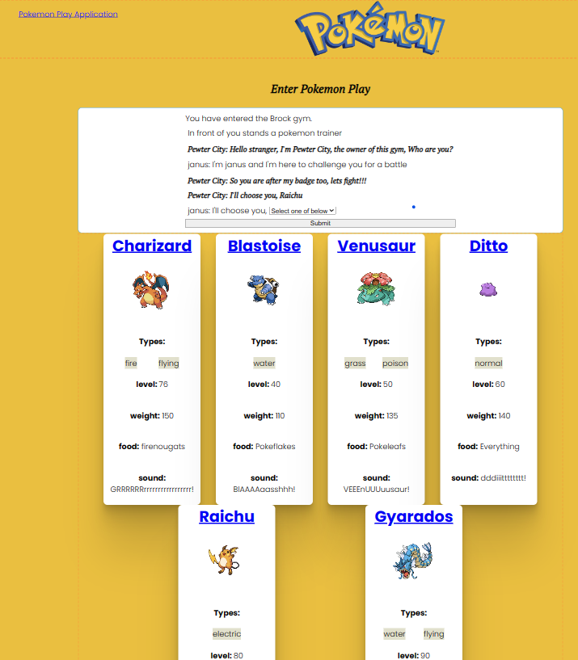

# Applicatie-beschrijving

## Inleiding
Via Novi Frontend React cursus kwam ik tot de ontdekking dat er een Poké API bestaat waarmee je Pokémon data mee kunt ophalen! 
Er is ook een Novi Backend Java cursus opdracht via welke je een Pokémon spel kunt spelen.
Ik besloot een applicatie te bouwen waarmee je een selectie Pokémons kunt bekijken, en vervolgens een Pokémonspel kunt spelen.

Het frontend gedeelte van het project is opgezet met [Create React App](https://github.com/facebook/create-react-app).

## Eindresultaat
Focus van deze opdracht is niet styling, maar (beperke) functionaliteit. Maar omdat iedereen blij wordt van leuke kleurtjes, is het voorbeeld toch voorzien van styling:

## De applicatie starten
Als je het project gecloned hebt naar jouw locale machine, installeer je eerst de node_modules door het volgende commando in de terminal te runnen:

`npm install`

Wanneer dit klaar is, kun je de applicatie starten met behulp van:

`npm start`

of gebruik de WebStorm knop (npm start). Open http://localhost:3000 om de pagina in de browser te bekijken.

## Applicatiebeschrijving

Een speler kan via deze frontend-react applicatie een spel kan spelen. 
Degenen die bekend zijn met Pokémon weten dat deze altijd een _type_ hebben (sterker nog: Pokémon kunnen meerdere types tegelijk zijn, maar om het niet te moeilijk
te maken, maken we gebruik van één type per Pokémon). Voorbeelden van deze typen zijn: Fire 🔥, Water 🌊, Grass 🌿 en
Electric ⚡. 
Daarnaast is er een gym owner genaamd 'Pewter City'  in de stad 'Brock' en een trainer/speler, zodat de applicatie interactief kan worden.

De speler meldt zich aan met zijn naam en wordt uitgenodigd een Pokémon spel te spelen.
Vervolgens krijgt hij zes Pokémon kaarten te zien met daarop o.a. de naam, afbeelding, het type, het level (nivo), het gewicht (hp), voedsel, en stemgeluid en kan de speler het spel starten.

Op de vervolgpagina presenteert de gymowner zich met een kaart en mag de speler ook een Pokémon kaart kiezen.

Het derde scherm toont beide gekozen kaarten bovenaan en dan kan het spel starten, 
* waarbij de gymowner eerst een aanval doet en daarna de speler. Het resultaat verschijnt in de regels onder de pagina.
* Vervolgens mag de speler kiezen of hij gaat aanvallen of zijn kaart wil wijzigen.
* Als hij aanvalt dan krijgt hij eerst vier mogelijke aanval-tactieken te zien en kan hij hieruit kiezen.
* Als hij wijzigt, gaat hij een scherm terug om een andere Pokémon kaart te kiezen.
* Nadat de speler een aanval heeft gedaan, is het de beurt van de gymowner om een vervolgaanval te doen.
* Als een van de twee geen hp meer heeft, dan wordt de winnaar bekend gemaakt en krijgt de speler de keuze om nog eens te spelen of te stoppen.

## Randvoorwaarden
Extra specifieke Pokémon data zoals een afbeelding wordt opgehaald via de Poké API en deze wordt weergeven in de betreffende Pokémon kaart op het scherm van de Application.
Hier heb je geen API key voor nodig!

Bekijk de documentatie van de Poké API [hier](https://pokeapi.co/).

Als je het spel wil spelen moet je tevens de backend hiervoor eerst opstarten. Hierin wordt gebruik gemaakt van een SQL database (PostgresQL) die via de backend wordt geactiveert.

* Elk pokémon kaartje bevat een _naam_, een afbeelding, lijst van _abilities_, _gewicht_, en de hoeveelheid _moves_.
* Elk spel wordt vastgelegd door een record toe te voegen aan de SQL database, die benaderbaar is via API calls naar "http://localhost:8080/api/pokemonplay".
* Telkens als er een keuze is gemaakt voor een kaart wordt dit vastglegd in de database, via een update van het record.
* Het record bevat de namen van de speler en de gymner en de kaarten waarmee ze spelen.
* Voor elk Pokémon spel worden een of meerder textlijnen door de backend aangemaakt in de database, die ingelezen kunnen worden om de resultaten te laten zien.
* 
* 